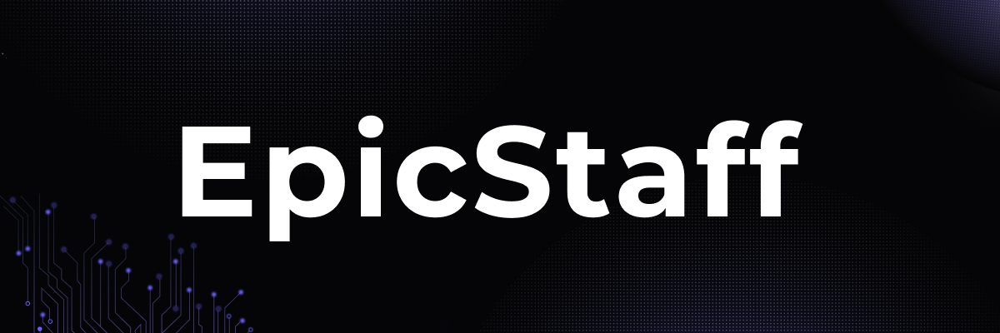

# EpicStaff: Open-Source Multi-Agent Orchestration Platform

<div align="center">
   
[](https://github.com/EpicStaff/EpicStaff/stargazers)
[](https://github.com/EpicStaff/EpicStaff/network/members)
[](https://github.com/EpicStaff/EpicStaff/blob/main/LICENSE)
[](https://github.com/EpicStaff/EpicStaff/commits/main)
[](https://github.com/EpicStaff/EpicStaff/issues)

</div>

### AI Agents Without The Frustration. Build Production-Grade Agentic Systems with Visual Workflows and Full Backend Control.

EpicStaff is an open-source **production-grade platform** for building **multi-agent AI systems** with maximum flexibility and minimum friction. We bridge the gap between no-code simplicity and developer centric power, offering a unified **custom AI agent workflow platform**.

Create intelligent agents that operate with high performance, retain memory across complex tasks and reason based on injected knowledge. Our **asynchronous, low-latency AI orchestration engine** built on **FastAPI** ensures your AI workflows are both fast and scalable.

<div align="center">
   
Our core philosophy: **We hide the complexity, not the logic.**

**⭐ Star us on GitHub to support the project and follow our progress!**

</div>

---

<div align="center">
   
### Watch EpicStaff in Action!


</div>

---

## 🚀 Getting Started

This guide will help you launch EpicStaff using our system installer, which manages the Docker containers for you.

### Windows/Linux

### 1. **Install dependencies**  
   - [Git](https://git-scm.com/downloads)  
   - [Docker Desktop](https://www.docker.com/products/docker-desktop/)

### 2. Download the Installer
Download the latest release for your operating system from our releases page.
- **➡ [Download Latest Release](https://github.com/EpicStaff/EpicStaff/releases)**

### 3. Unzip and Run
Unzip the downloaded file and run the EpicStaff application.
 
**For more [details](docs/docs.pdf)**

---

### 🛠️ **Important Step for macOS Users**

Before running the application on macOS for the first time, you need to grant it execution permissions.

**Why is this necessary?**
macOS has a security feature called Gatekeeper that can block applications downloaded from the internet. The following commands simply tell your system that you trust EpicStaff and allow it to run.

Open your terminal navigate to the unzipped directory and run these two commands:
```bash
chmod -R epicstaff.app
xattr -r -d com.apple.quarantine epicstaff.app
```

---

### MacOS Launch Instructions (Manual)

### 1. Clone the Project
`git clone -b stable --single-branch https://github.com/EpicStaff/EpicStaff.git`
### 2. Change .env file
```bash
sed -i '' 's|CREW_SAVEFILES_PATH=/c/savefiles|CREW_SAVEFILES_PATH=~/savefiles|' src/.env
```
Replace ~/savefiles with your preferred location
### 3. Make sure you have Docker installed and running
### 4. Use next command to run the project
```bash
cd src && docker volume create sandbox_venvs && docker volume create sandbox_executions && docker volume create crew_pgdata && docker volume create crew_config && docker-compose up --build
```

---

## One Platform, Two Workflows: Visual and Code

We built EpicStaff to serve everyone involved in building AI-powered solutions, from business analysts to senior developers.

### 🔹 For Business Teams & No-Code Users: Visual AI Project Builder

Create powerful, multitasking AI agents through our intuitive **visual AI workflow builder**. Use a node-based **graphic interface** to connect pre-built blocks for text analysis, response generation, file management, CRM integration and more. Go from idea to a functional AI agent **without writing a single line of code**.

### 🔹 For Developers: A High-Performance FastAPI Multi-Agent Backend

Get full control with a modular transparent **open-source FastAPI backend**. Dive deep into our **event-driven architecture** to customize orchestration logic define **fine-grained task control** and integrate custom Python tools seamlessly. No black boxes, no magic just a clean extensible **RESTful agent orchestration** framework that respects your need for control.

**Whether you're experimenting, prototyping or deploying to production EpicStaff adapts to you:**
* Use the **drag-and-drop visual interface** when speed is key.
* Dive into the **Python backend** when custom logic is required.
* Combine both approaches seamlessly in a single project.

> We hide the complexity, not the logic.

---

## Who is EpicStaff For?

* **AI Developers** seeking a flexible **FastAPI agent framework** without rigid templates.
* **Business Teams** who need to quickly **build custom AI workflows** for automation.
* **No-code/Low-code users** who prefer a **visual interface** over YAML or complex scripts.
* **R&D Teams & Startups** prototyping and deploying **scalable agentic systems**.

---
## Where EpicStaff Fits In

Here’s a quick look at how EpicStaff compares to other popular tools in the AI and automation space. Our unique hybrid approach is designed for cross-functional teams.

| Platform | Primary Target Audience | Primary Interface | Extensibility | Key Weakness |
|---|---|---|---|---|
| **EpicStaff** | **Business Operations + AI Engineers** | **Hybrid (Visual + Code)** | **High** | **New player on the market** |
| n8n | Business Operations / Citizen Developers | Visual | Medium | Limited native AI capabilities |
| LangGraph | AI Engineers / Developers | Code-First | High | High entry barrier |
| CrewAI | Developers / AI Enthusiasts | Code-First | High | Oriented towards specific tasks |
| Zapier | Business Users (No-Code) | Visual | Low | No access to code |
---

## Key Features

| Feature                        | Description                                                                                                                                                                                                   |
| ------------------------------ | ------------------------------------------------------------------------------------------------------------------------------------------------------------------------------------------------------------- |
|  **Visual AI Workflow Builder** | Visually build, debug, and manage complex AI workflows with our intuitive **graphic interface**. This **no-code** tool is perfect for rapid prototyping and team collaboration.                                 |
|  **Memory & Contextual Reasoning** | Implement robust **memory persistence**, allowing agents to retain context across multi-step workflows. Develop a powerful, **context-aware reasoning engine** for smarter decision-making.                   |
|  **Knowledge Injection (RAG)** | **Inject knowledge from files** and structured data to ground LLM responses, enhance accuracy and reduce hallucinations.                                                                                    |
|  **Custom Python Tools** | Easily extend agent capabilities by connecting your own **Python tools**. Integrate any custom logic or API without needing to redeploy the entire system.                                                     |
|  **Full Developer Control via API** | Gain complete **control over the orchestration layer** via a flexible **RESTful API**. Manage task execution with **fine-grained task control** for maximum precision.                                     |
|  **High-Performance Core** | Powered by a **high-performance asynchronous core** built with **FastAPI**. Our **event-driven architecture** is optimized for **low-latency** agent responses making it suitable for real-time applications. |
|  **Modular & Extensible Backend** | We provide a **modular open-source backend** that is easy to extend and modify. Adapt the platform to the unique needs of your project.                                                               |
|  **Multi-Agent Orchestration** | Design complex **multi-agent systems** where agents can collaborate to solve sophisticated problems. The platform is LLM-agnostic and supports any language model.                                          |

---

## Our Mission & Values

**Mission:** To empower teams to build intelligent AI agents: quickly, collaboratively and without unnecessary complexity.

*  **Clarity over complexity:** We hide the overhead, not the logic.
*  **Collaboration by design:** Visual-first for non-technical users, full code flexibility for developers.
*  **Developer Respect:** No black boxes. Just a clean, extensible architecture that gives engineers the control they need.
*  **Open by Default:** Fully open-source, modular and community-driven.

---

**Join us on the journey to shape the future of intelligent, collaborative systems!**

---

## Join Our Community & Shape the Future of EpicStaff

EpicStaff is an open-source project driven by its community. Whether you're a developer, a no-code enthusiast, or a business professional, your feedback and contributions are what make this project grow.

* **⭐ Star the Repository:** The easiest way to show your support and stay updated.
* **💬 Connect on Reddit:** For real-time chat with the community and the core team, join our [Reddit Community](https://www.reddit.com/r/EpicStaff_AI/). 
* **🤝 Contribute:** Found a bug or want to add a new tool? Check out our [CONTRIBUTING.md](CONTRIBUTING.md) to get started. We welcome all contributors!

**Let's build the future of intelligent, collaborative systems together!**

## 🙏 Special Thanks

Our platform leverages the innovative work of the open-source community. A special thank you goes out to **[Foblex](https://github.com/Foblex)** for their collaboration and fantastic contributions.

* We proudly use the **[f-flow library](https://github.com/Foblex/f-flow)** which is a core part of our architecture.
* Foblex helps us spread the word by featuring EpicStaff in his articles and educational materials. You can check out his work at **[flow.foblex.com](https://flow.foblex.com/)**.

We believe in the power of collaboration and are grateful for such a great partnership.

